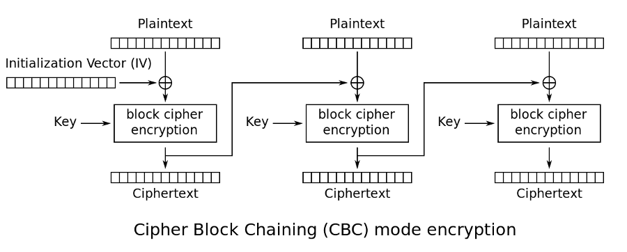

# Cryptography

- Goals
- Terms
- Mechanics
- Symmetric Ciphers
- Asymmetric Ciphers
- Random Numbers
- Cryptographic Hash Functions
- MACs
- Signatures

--
# Goals

- Confidentiality: outside parties can't decipher messages
- Integrity: outside parties can't tamper with messages
- Authentication: being certain of who you are communicating with

--
# Terms

- Cipher

  The means of turning a message into encrypted text and then later reversing
  process.

- Plaintext

  The text of the message.  Often the text will need to be formatted slightly
  for the encryption process.

- Ciphertext

  The outcome of applying the cipher to the plaintext.

- Key

  The key is the secret number used by the cipher to encrypt the message.
  Recipients need the key to decrypt the ciphertext.  In asymmetric ciphers,
  there are two keys and only one is kept secret.

Note:
Some ciphers may require the text to be in certain formats (for example in
blocks of 16 bytes with padding on the end to fill up any short blocks).

--
# The Simplest Cipher

XOR is both reversible and its own inverse.

| Plaintext | Key | Ciphertext |
|-|-|-|
| 0 | 0 | 0 |
| 0 | 1 | 1 |
| 1 | 0 | 1 |
| 1 | 1 | 0 |

| Ciphertext | Key | Plaintext |
|-|-|-|
| 0 | 0 | 0 |
| 1 | 1 | 0 |
| 1 | 0 | 1 |
| 0 | 1 | 1 |

--
# XOR in Practice

Pros:

- When used correctly, it yields ciphertext that is immune to cryptanalysis

Cons:

- Not very practical: you need a completely random key as long as the
  message itself
- The key can never be reused and must be distributed securely

Using XOR in this fashion is called a one-time pad.  The typical usage scenario
would be a diplomat carries a USB key filled with random data (the "pad") to an
embassy.  The same data is retained at the capital.  Messages can be exchanged
until the data runs out.  Then the pad must be permanently destroyed.

The first version of the famous "red telephone" hotline between Washington D.C.
and Moscow used a one-time pad.

--
# Symmetric Ciphers

- One key to do all the work

  Plaintext + Key = Ciphertext

  Ciphertext + Key = Plaintext
- Fast
- Best for communication between just two parties
- Come in 2 varieties: stream and block

--
# Stream Ciphers

- The key is used as an argument in a function that creates a stream of random
  data.
- Each plaintext bit is XORed with a bit from the keystream.
- Examples: ChaCha20/Salsa20, RC4 (No longer considered secure)

--
# Block Ciphers

- Chop the plaintext up into fixed-sized blocks and pad the last block if
  needed
- The key is also of fixed sized
- The cipher executes pseudorandom permutations on the plaintext using the key
  and various operations: XOR, bit shifts, matrix transformations, lookup tables
  ("S-boxes")
- Examples: AES (Rijndael), Blowfish, IDEA

--
# Block Cipher Modes
- Determine how to apply the block cipher across multiple blocks
- Simplest is electronic codebook (ECB).  Encrypt each block independently.  Not
  good though since patterns can appear.  E.g. encrypted version of "GET /
  HTTP/1.1" over and over.
- Other modes allow block ciphers to operate as stream ciphers (e.g. CTR mode)
- More common is cipher block chaining (CBC).  The result of each blocks
  encryption is fed into the next.  The first block is primed with a random
  initialization vector

--
# Examples

Alice <!-- .element: class="caption" -->

Bob <!-- .element: class="caption" -->

Alice and Bob are on tour together and decide they want to collaborate but
they don't want the paparazzi to find out.

--
# Example - Symmetric

Alice and Bob agree on the key "heavymetal" before departing the tour

<pre><code>
% echo "Let's add an umlaut to the name" | openssl aes-256-cbc -a -pass pass:heavymetal | tee to_bob.txt
U2FsdGVkX18YUwyJ40AENC/KHY33SQ64zcJjNEixiOaITdgKlTt2hegIVTV0+htO
nLPNDb0wIcqTaW1izJHRBA==
</code></pre>

<pre><code>
% openssl aes-256-cbc -d -a -pass pass:heavymetal -in to_bob.txt
Let's add an umlaut to the name

% echo "Too cliche" | openssl aes-256-cbc -a -pass pass:heavymetal | tee to_alice.txt
U2FsdGVkX1+Iznlb/aup/LddQM9AJnr8U/UXlV7WAyg=
</code></pre>

<pre><code>
% openssl aes-256-cbc -d -a -pass pass:heavymetal -in to_alice.txt
Too cliche
</code></pre>

--
# Asymmetric Ciphers

- Two keys: public and private

  Plaintext + Public Key = Ciphertext

  Ciphertext + Private Key = Plaintext
- The public key is shared with the world
- All these public keys need an infrastructure (PKI) to manage them
- Examples: RSA, ElGamal, ECDSA

--
# Example - Asymmetric

Alice and Bob exchange public keys before departing the tour

<pre><code>
% echo "Do the amps go up to 11?" | openssl rsautl -pubin -inkey bob.pub -encrypt | openssl base64 | tee to_bob.txt
eojXM/WUB65wbatFBn88TEvr7YBi5haP7iS0ID5RpFn7sPiY0J+fNvfTkctLwhfP
pP79KdF4RR6Fnoh+ZIB3ciOI3TxKovtQUgQOFGT4N++4w+4DuPfIl9do3DGLUhpt
6/rsyqIRMbF7S3aVbYEE0rQ5hYz2OEbmT64H8vBtFKrPaF6+xnX+tme2Pu1IO8qd
qY1bOlsfiI4H4QzaIDKoCA1uT5JK2u2QQyTFrCFfYdm610QARVyDShgBr/VggUQx
L2ua88+Yzme5jkcEQ5emb48dPm9xL9xaYN+NmPXmyd3+0r/i6PtHKwdGC6/H22c9
m9CWn+ClOal7ML54lBgdXw==
</code></pre>

<pre><code>
% openssl base64 -d -in to_bob.txt | openssl rsautl -inkey bob.key -decrypt
Do the amps go up to 11?

% echo "Totally" | openssl rsautl -pubin -inkey alice.pub -encrypt | openssl base64 | tee to_alice.txt
IjPBJ80M4+seS+v+b6cu/ItC/YjfSje7y+euRMJHdeV4nPnU5kQitUNJipdCowX0
rz3bOH6Hngfxgvsby+AXyhlQN2INwPD6N9wtx/XEXrGPvPN5QUIym1grtDohQipi
EPxu1xDbUof2PBlmyiq21N8u5GhaNItj9sEVrwk+YoDojHCSn78taUkuQ3JFNwRP
+yc7i9AN7BoN8OHrK5nGBwo4glI6wN5C4ppJV0i6MdTnRTsRjDAVkJAJhnOb4uhA
69SsQUMaaaZRFU+vsqIrja2iMoRKMUQAvAdjcarGYxO18blGTZ3yVE84mXo216Qr
Gk8etvyyOZa0u5M5oJpbTw==
</code></pre>

<pre><code>
% openssl base64 -d -in to_alice.txt | openssl rsautl -inkey alice.key -decrypt
Totally
</code></pre>

--
# Random Numbers

- At the heart of everything.  Without a secure source of randomness, we end up
  with predictable keys.
- Hard to generate randomness on a deterministic device.  Computers use
  - Intervals between keyboard inputs
  - Mouse movements
  - Hardware devices (e.g. Cloudflare uses lava lamps!)
- Entropy is gathered, debiased, turned into a seed, and input into a
  cryptographically secure pseudorandom number generator.
- Example: `/dev/random` and `/dev/urandom`

--
# Cryptographic Hash Functions

- Send in some input and get a unique, fixed-length output (a "digest")
- One way trip: someone with just the hash can't work backward to get the
  message
- Should be "computationally infeasible" to find:
  - Any message producing a specific hash (preimage resistance)
  - Any message whose hash collides with that of another given message's (second
    preimage resistance)
  - And more generally, any two messages that produce a collision (collision
    resistance)
- A small variation in the message leads to large variation in the hash
- Used to create unique fingerprints for files, messages, certificates, etc.
- Examples: MD5 (don't use), SHA1 (don't use), SHA256

Note:
No two people have the same fingerprint (in theory) and you can't take a
fingerprint and work backwards to get a person.

--
# MACs

- Message Authentication Codes
- Sent with the message to provide authentication and integrity
- MAC algorithms can be constructed from one or more cryptographic primitives
- HMACs (Hashed MACs) mix the key and the message together and hash them:
  H(K + H(K + M)) where "+" is concatenation.
- Recipient performs the same mix with the shared key and the message they
  received.  If there's a mismatch, the message has been tampered with

Note:
The specific function H(K + H(K + M)) is beyond this talk but it's formulated to
protect the integrity of the HMAC itself.

--
# Signatures

- An *encrypted* hash using a private key (asymmetric ciphers)
- Provide authentication, integrity
- For RSA, creating a signature is the inverse of encrypting a message:

  Hash(Plaintext) + Private Key = Signature

  Signature + Public Key = Hash(Plaintext)
- Recipient compares the hash they calculate with the hash they decrypted
  using the sender's public key.  If they match, we know the message
  could have only come from someone with the private key
- Other algorithms use different signing methods but same general concept

--
# Example - Signatures

Alice sent a message to a mailing list and Bob wants to verify that Alice wrote it

<pre><code>
% echo "School's out for summer" > lyrics.txt
% openssl sha256 lyrics.txt | openssl rsautl -inkey alice.key -sign | openssl base64 >> lyrics.txt
% cat lyrics.txt
School's out for summer
TW510XuRliGtf2jtLcLdGwcTq2In5w9ULKreG4RY0li6fiere9umq7Z3MC9jNHft
QmzKfekGklINKyVAA3QWh77O7MnUL2Z28DG77iH2eAhYqPDNTactSvqwrFT0c1MJ
/m05qT2a3AVYEzO++aQYS/c+tcDIwf3iKrZgXXLYFQzABjfMuBp1M+3oizFi1nqE
JXUk3/BiK+2CHLtyszGzPhdCfYVKjQPlZvpwHa06HnZsWIcSCcL3Uy5x0DIitriq
VbvGyyrIlfhwpaQYHtqggUto+Yj011rTOIXfRnk4NxDq3MHQHsJmQ2dm9hnveJI4
8mSi+GCwRdW+fLDsYzeVXA==
</code></pre>

<pre><code>
% sed -n '1p' lyrics.txt > message.txt
% sed -n '2,$p' lyrics.txt > signature.txt
% openssl base64 -d -in signature.txt | openssl rsautl -inkey alice.pub -pubin -verify
SHA256(lyrics.txt)= 6c4fc3b953f7ad20a087b6d24b3dc16bb70a6ce1ac5cce51c369fed2e97faf92
% openssl sha256 message.txt
SHA256(message.txt)= 6c4fc3b953f7ad20a087b6d24b3dc16bb70a6ce1ac5cce51c369fed2e97faf92
% diff -s -q <(!! | cut -d' ' -f2) <(!-2 | cut -d' ' -f2)
Files /proc/self/fd/11 and /proc/self/fd/12 are identical
</code></pre>

--
# Example - Signatures

Lemmy Kilmister gives Bob a message from Alice but it doesn't sound like Alice...

<pre><code>
% echo "No more Mr. Nice Guy" > lyrics2.txt
% openssl sha256 lyrics2.txt | openssl rsautl -inkey alice.key -sign | openssl base64 >> lyrics2.txt
% openssl rsautl -inkey alice.key -sign -in lyrics2.txt | openssl base64 >> lyrics2.txt
% cat lyrics2.txt
No more Mr. Nice Guy
XLNoxhulst///d1gDGIrx5OcjVRJqlfuNl0fi3i212Y/K8ams/qOKn9pnYWXD7dv
RMkZJmebSzl7yy+y9koNSMJFRtNy5kd95Lt6nZjXwaJ1HO+Xhauo0McGKirs4teP
w79xz1P9Tm4aUb7QCkhX9ypPYoX8B7h4CH0ld+SQLx0Z0bIiHsIgvAlvqF45OH7S
O/0beCncXmef4O4T2xQcJMbjxrNWVDdl7aMgaeDf4tYxdbzuuusacVqw/uU9L1hu
RTXEpPxpppTG+DQ7dFIzCOQI6fusCCYSmC6iVHRBX97yfodpIkP2qt1dDdxBvAQv
ibi8ab815W62xEjhUrbXSA==
</code></pre>

<pre><code>
% cat lyrics-strange.txt
The only card I need is the ace of spades
XLNoxhulst///d1gDGIrx5OcjVRJqlfuNl0fi3i212Y/K8ams/qOKn9pnYWXD7dv
RMkZJmebSzl7yy+y9koNSMJFRtNy5kd95Lt6nZjXwaJ1HO+Xhauo0McGKirs4teP
w79xz1P9Tm4aUb7QCkhX9ypPYoX8B7h4CH0ld+SQLx0Z0bIiHsIgvAlvqF45OH7S
O/0beCncXmef4O4T2xQcJMbjxrNWVDdl7aMgaeDf4tYxdbzuuusacVqw/uU9L1hu
RTXEpPxpppTG+DQ7dFIzCOQI6fusCCYSmC6iVHRBX97yfodpIkP2qt1dDdxBvAQv
ibi8ab815W62xEjhUrbXSA==
% sed -n '1p' lyrics-strange.txt > message.txt
% sed -n '2,$p' lyrics-strange.txt > signature.txt
% openssl base64 -d -in signature.txt | openssl rsautl -inkey alice.pub -pubin -verify
SHA256(lyrics2.txt)= 7bb2c4647ab5b0002e1de8686e1d8e1cc5568f85b0866006dfa60025966e64c3
% openssl sha256 message.txt
SHA256(message.txt)= e4f97ede052cb671344553e8dff2b1b61ed077548a5dce9a575b9fd0af37b0b1
% diff -s -q <(!! | cut -d' ' -f2) <(!-2 | cut -d' ' -f2)
Files /proc/self/fd/11 and /proc/self/fd/12 differ
</code></pre>

