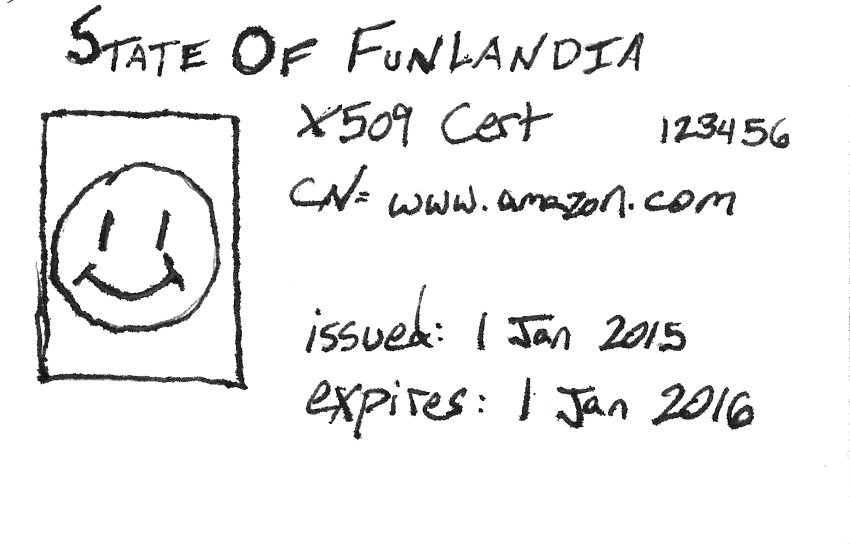
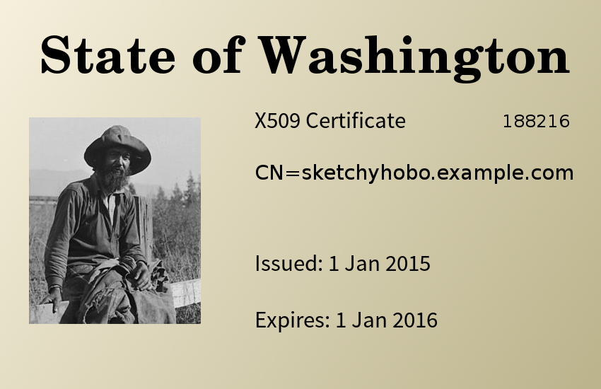

## PKI Concepts

- Trust
- The Web of Trust
- Certificate Authorities
- Creating Trust
- ASN.1
- Formats
- X509 Certificates
- Trust Stores
- Keys
- Certificate Signing Requests
- Certificate Subjects
- Certificate Revocation Lists
- Certificate Extensions
- Key Stores

--
# Trust

- Public key cryptography isn't useful if no one has your public key
- Easiest way is to meet your friend for coffee, and exchange public keys.
- This doesn't scale well.  Better would be to throw a big party and exchange
  keys with all your friends at once. (Yes, this is a thing that happens)
- But Alice misses the party, so you give the keys to her.  But Bob missed the
  party too, and this is getting tedious.
- Bundle the public keys and identity together and sign the bundle with your
  private key and upload it.
- Alice and Bob already have your public key and can verify the signatures.

--
# The Web of Trust

- Expand the "sign & upload" practice across a network of people
- I don't know Charles, but I do know and trust Bob and Bob signed Charles' key
- Works fine for social circles.  It's how GPG works
- Doesn't scale for large networks with very few interconnections (e.g. the web)
- What if there were a few very trustworthy people and you could just trust
  whatever they signed?

--
# Certificate Authorities

- The public key/identity bundles are called *certificates*
- These "very trustworthy people" are organizations called *certificate
  authorities* (CA)
- You submit a *certificate signing request* (CSR) containing your public key
  and identity and usually pay some money
- They verify your identity (e.g. if you assert the identity www.example.com,
  they send a challenge email to the address listed in the WHOIS entry)
- They sign your CSR and give you the resulting certificate
- You install your certificate on your web server and when browsers connect over
  HTTPS, you send your certificate.  The browser performs other steps to ensure
  you have the private key (e.g. you are who you say you are) and establishes a
  secure channel

--
# Creating Trust

- Who signs the public keys of certificate authorities?  The certificate
  authority itself!
- *Self-signed* certificates are called trust anchors or root certificates
- CAs prove to browser and operating system makers that they are trustworthy
  - Root certificate private keys are stored in hardware security modules
  - In a vault
  - With alarms and cameras
  - Completely offline
- Browsers and OSes include the root certificates in a *trust store*

--
# Trust As A Chain

- Accessing the root certificate private keys for signing isn't trivial
- CAs create intermediate certificates that are marked as being able to act as
  CAs also
- Intermediate CAs are put on systems that are online so signing can be
  automated and scale up to issuing many certificates a day
- When you pay the CA, your certificate becomes a *leaf certificate* (AKA
  *end entity certificate*) at the end of the chain of trust
- Programs start at the trust anchor validating the signature (and other things)
  of the next certificate and so on until the end of the chain
- Leaf certificates are *not* able to act as CAs.

--
# When There Is No Trust
- When clients try to make a connection using certificates (e.g. SSL/TLS)
  and the issuer of the server cert is unknown, the client aborts the connection

  ```none
  % curl https://koji.fedoraproject.org
  curl: (60) Peer's certificate issuer has been marked as not trusted by the user.
  More details here: http://curl.haxx.se/docs/sslcerts.html

  curl performs SSL certificate verification by default, using a "bundle"
   of Certificate Authority (CA) public keys (CA certs). If the default
   bundle file isn't adequate, you can specify an alternate file
   using the --cacert option.
  If this HTTPS server uses a certificate signed by a CA represented in
   the bundle, the certificate verification probably failed due to a
   problem with the certificate (it might be expired, or the name might
   not match the domain name in the URL).
  If you'd like to turn off curl's verification of the certificate, use
   the -k (or --insecure) option.
  ```

--
# Example - Trust



"Excuse me, I would like to withdraw $100,000.  Here is my identification." <!-- .element class="caption" -->

--
# Certificate Authorities - Roll Your Own

- No reason you can't create your own CA.  Perfectly reasonable for large
  organizations (and much cheaper)
- The trick is to make sure everyone in your organization has and trusts the
  CA certificate

  ```none
  % curl --cacert ~/.fedora-server-ca.cert https://koji.fedoraproject.org
  <!DOCTYPE HTML PUBLIC "-//IETF//DTD HTML 2.0//EN">
  <html><head>
  <title>302 Found</title>
  </head><body>
  <h1>Found</h1>
  <p>The document has moved <a href="https://koji.fedoraproject.org/koji">here</a>.</p>
  </body></html>
  ```

Note:
The certificate for koji.fedoraproject.org is not signed by a commercial CA and
most systems won't have the CA the cert used in their truststores.  If we
connect and tell curl explicitly that we trust the Fedora Project CA, everything
works.

--
# ASN.1

- Abstract Syntax Notation One
- Similar in concept to Backus-Naur Form
- A way to describe data and data-types
- Start simple and move up
- The building blocks of PKI

Note:
Pretty much everything is in ASN.1: Keys, certificates, certificate signing
requests, etc.

--
# ASN.1 - Trivial Example

```
Widget ::= SEQUENCE {
    model UTF8String,
    serialNumber INTEGER,
    inspections SEQUENCE OF InspectionInfo
}

InspectionInfo ::= SEQUENCE {
    inspectorName UTF8String,
    inspectionDate DATE
}
```

Note: Let's say we have a Widget.  Every Widget has a model name, a serial
number, and some inspection information with the name of the inspector and the
date for every inspection.  Here's how we represent that in ASN.1.

Now let's go over that.  A SEQUENCE is one of the four ASN.1 structured types
and it's just an ordered collection of items.  Inside that sequence we have an
UTF8String, an INTEGER, and another sequence.  The inspections item is a
SEQUENCE OF, another structured type that holds zero or more occurrences of a
given type. In this case, the given type is InspectionInfo.

We continue down and see InspectionInfo is also a SEQUENCE containing the
inspector's name and the inspection date.

--
# ASN.1 - Real Example

PKCS1 - Format for storing RSA keys

```none
RSAPublicKey ::= SEQUENCE {
    modulus           INTEGER,  -- n
    publicExponent    INTEGER   -- e
}

RSAPrivateKey ::= SEQUENCE {
    version           Version,
    modulus           INTEGER,  -- n
    publicExponent    INTEGER,  -- e
    privateExponent   INTEGER,  -- d
    prime1            INTEGER,  -- p
    prime2            INTEGER,  -- q
    exponent1         INTEGER,  -- d mod (p-1)
    exponent2         INTEGER,  -- d mod (q-1)
    coefficient       INTEGER,  -- (inverse of q) mod p
    otherPrimeInfos   OtherPrimeInfos OPTIONAL
}

Version ::= INTEGER { two-prime(0), multi(1) }
    (CONSTRAINED BY {
        -- version must be multi if otherPrimeInfos present --
    })

OtherPrimeInfos ::= SEQUENCE SIZE(1..MAX) OF OtherPrimeInfo

OtherPrimeInfo ::= SEQUENCE {
    prime             INTEGER,  -- ri
    exponent          INTEGER,  -- di
    coefficient       INTEGER   -- ti
}
```

From [RFC 3447](https://www.ietf.org/rfc/rfc3447.txt)

--
# ASN.1 - According to OpenSSL's `asn1parse`

```none
% openssl genrsa 2048 2> /dev/null | openssl asn1parse
    0:d=0  hl=4 l=1189 cons: SEQUENCE
    4:d=1  hl=2 l=   1 prim: INTEGER           :00
    7:d=1  hl=4 l= 257 prim: INTEGER           :DF313FF1...
  268:d=1  hl=2 l=   3 prim: INTEGER           :010001
  273:d=1  hl=4 l= 257 prim: INTEGER           :A5CEE1B1...
  534:d=1  hl=3 l= 129 prim: INTEGER           :FEF2403F...
  666:d=1  hl=3 l= 129 prim: INTEGER           :E01D66B4...
  798:d=1  hl=3 l= 129 prim: INTEGER           :EFCF535C...
  930:d=1  hl=3 l= 129 prim: INTEGER           :A00CFF33...
 1062:d=1  hl=3 l= 128 prim: INTEGER           :38264063...
```

And we can see that corresponds to the schema described in the previous
slide for a private key.  The version is set to "0" and "010001" is hex
for 65537, a common value for an RSA public exponent.

--
# Formats

- DER (Distinguished Encoding Rules)
  - Binary encoding
  - No ambiguity; Only one way to represent any given value
- PEM
  - Base64 encoded DER with header and footer
  - Most common format
  - Example:

    ```none
    -----BEGIN CERTIFICATE-----
    MIIK6zCCBt+gAwIBAgIJAMXcvW[...]
    VQQGEwJVUzEXMBUGA1UECBMOTm[...]
    [...]
    -----END CERTIFICATE-----
    ```
- Anything can be in these formats: keys, certificates, signing requests
- Don't name your files ".pem".  It doesn't provide any information about
  what is actually in the file and forces others to have to inspect the file
  to determine its purpose.
- ".pem" is like a sushi restaurant describing every menu item as "fish and
  rice".

Note:
You've got all the components you need to define something in ASN.1.  Now
what?  We need to encode the data.  The standard method uses Distinguished
Encoding Rules which encode the data in an unambiguous manner.  DER is a
binary format which isn't very useful if you need to email the certificate
or print it to your terminal.  Taking the DER and base64 encoding it solves
the problem.  Now we have a blob of ASCII text that we add a descriptive
header and footer onto.  The result is a PEM file.  PEM stands for
Privacy-enhanced Electronic Mail which is due to the format's history
with PGP.  It's a fun bit of trivia, but not relevant in the modern era.

--
# X509 Certificates

*Traditional file extension: ".crt" or ".cert"*

- *Cert* for short
- An ASN.1 object with a public key, an identity, and other data
- Signed by the Issuer
  - CA
  - Self-signed ("trust me")
- Used for identification since the private key is only known by the cert
  owner
- Used with SSL/TLS to ensure you are connecting to the server you think you're
  connecting to.

--
# X509 - Anatomy

- *Version*: "3" is the latest
- *Serial Number*: Of limited interest.  Use a SHA256 fingerprint for
  identification
- *Issuer*: Entity that vouches for this certificate
- *Validity*: How long is this certificate good?
- *Subject*: Who the certificate owner claims to be
- *Extensions*: Many and varied.  We'll get back to these
- *Certificate Signature*: A digital signature from the Issuer to prove the
  certificate hasn't been tampered with
- *Subject Public Key Info*: The components of the public key

Note:
We'll talk about the purpose of the Validity when we get to certificate
revocation lists.

--
#X509 - Example

```none
Certificate:
  Data:
    Version: 3 (0x2)
    Serial Number: 31647 (0x7b9f)
  Signature Algorithm: sha256WithRSAEncryption
  Issuer: C=US, ST=North Carolina, L=Raleigh, O=Fedora Project, OU=Fedora Project CA,
          CN=Fedora Project CA/emailAddress=admin@fedoraproject.org
  Validity
    Not Before: Apr 15 18:26:14 2014 GMT
    Not After : Apr 12 18:26:14 2024 GMT
  Subject: C=US, ST=North Carolina, O=Fedora Project, OU=Fedora Builders,
           CN=koji.fedoraproject.org/emailAddress=buildsys@fedoraproject.org
  Subject Public Key Info:
    Public Key Algorithm: rsaEncryption
      Public-Key: (4096 bit)
      Modulus:
        00:b5:ea:c6:39:97:d4:6b:b8:c3:87:26:c6:d0:c3:
      Exponent: 65537 (0x10001)
        X509v3 extensions:
          X509v3 Basic Constraints:
            CA:FALSE
          Netscape Comment:
            OpenSSL Generated Certificate
          X509v3 Subject Key Identifier:
            3C:[...]
          X509v3 Authority Key Identifier:
            keyid:C0:[...]
            DirName:/C=US/ST=North Carolina/L=Raleigh/O=Fedora Project/
              OU=Fedora Project CA/CN=Fedora Project CA/emailAddress=admin@fedoraproject.org
            serial:C5:DC:BD:63:32:07:D6:5E

    Signature Algorithm: sha256WithRSAEncryption
       95:62:87:c9:c6:4d[...]
```

(Taken from Fedora's Koji build system)

Note:
The validity period on this certificate is more than one would expect for a
plain vanilla certificate identifying a server.

--
# Truststores - The Devil is in the Details

- There are a half dozen different ways used to add CAs
  - Path to the PEM for the CA cert (curl)
  - Various types of binary stores
    - PKCS12
    - JKS (Tomcat, other Java tools)
    - NSS DB (Firefox)
  - Place CA PEM in special directory (Docker)
  - Add to the system truststore (nuclear option)

--
# Truststores - Adding to the System Truststore

- System truststore managed with the `ca-certificates` package in Fedora
- ***Do not add CAs casually!***
- Adding to it is simple:

  ```none
  % curl https://admin.fedoraproject.org/accounts/fedora-server-ca.cert -o
/etc/pki/ca-trust/source/anchors/cert/fedora-server-ca.cert
  % update-ca-trust extract
  ```
- You can also blacklist certificates by placing them in
  `/etc/pki/ca-trust/source/blacklist`

Note:
A Fedora system has a CA bundle (based on the Mozilla database of CAs)
courtesy of the `ca-certificates` package.

--
# Keys

*Traditional file extension: ".key"*

- The signee's private key
- Guarded with utmost care
- RSA is most common currently for certificates
- 2048-bit is the minimum you should use and good for around [10-15 years
  worth of security](http://www.keylength.com)
- 4096-bit should be used unless you have a compelling reason not to

--
# Certificate Signing Requests

*Traditional file extension: ".csr"*

- *CSR* for short
- Means of communication between a signee and a CA
- Contains requester's public key, the identity the requester is asserting,
  additional extensions the requester wants, and a signature
- Send it off to the CA
- CA requires you to prove you have the identity in the CSR
- CA sends you back a signed certificate
- The CSR file can generally be discarded at this point

Note:
A CSR can even be signed by multiple CAs.  This practice is called
"cross-signing".  You end up with two equally valid certificates because a
certificate can only have one Issuer.

--
# Certificate Subject

- Part of the CSR
- Made up of various components like country, organization, etc.
- Most important is the Common Name (CN)
- In SSL/TLS, the hostname you connect to *must* be the same as the CN in the
  subject of the certificate (although wildcards are allowed)

  ```none
  Subject: C=US, ST=North Carolina, L=Raleigh, O=Red Hat, Inc., CN=*.fedoraproject.org
  ```
- Why?  Otherwise a man in the middle (MITM) can get a cert signed for any
  domain and then use it to impersonate someone else.
- **It's not enough that a certificate is signed; it must also correctly identify
  the entity presenting it!**

Note:
Man in the middle attacks are a serious concern.  If you aren't doing hostname
verification and only checking that a certificate is signed by an accepted CA,
it's the equivalent of asking for someone's driver's license, ignoring the
name, and only checking that it has four corners and a hologram on it.

--
# Example - Certificate Subject



"Hi, Amazon.com here.  I would like to withdraw $100,000 from my account." <!-- .element class="caption" -->

- Certificate legitimately issued by a trusted authority
- With no CN verification, we would accept this and end up handing over money to
  sketchyhobo.example.com

--
# Certificate Revocation Lists

*Traditional file extension: ".crl"*

- *CRL* for short
- What happens when a signee loses or leaks their private key?
    - The certificate is no longer secure
    - People need to be informed of the breach
- CAs maintain a certificate revocation list
- CRLs are ASN.1 lists of revoked certificate serial numbers and digitally
  signed by the CAs
- Weakness is that clients have to check the CRL!
- Validity periods on certificates keep the CRL from growing without bound
- Other revocation mechanism is *Online Certificate Status Protocol* (OCSP)
  where a client connects a third-party server (usually run by the CA) to ask
  if the certificate in question is still valid.
- Neither revocation mechanism work very well

Note:
Digitally signing CRLs allows CAs to serve them over HTTP.  Why?  If they
were served over HTTPS, clients would end up having to check the revocation
status of the CRL server resulting in a vicious cycle

--
# Certificate Extensions

- Various sorts of data added to certificates
- Sent in the CSR, **but the CA doesn't have to include them in the signed
  cert!**
  - Always double check the cert you get back if you asked for special
    extensions
- Two types: critical (must be understood or cert is rejected) and
  non-critical (may be ignored if not understood)
- If you are brave and daring, you can even write your own

Note:
CAs not including extensions will be discussed with OpenSSL

--
# Certificate Extensions - Basic Constraints

- Critical in CA certificates
- CAs sign intermediate CAs

  ```none
  X509v3 extensions:
    X509v3 Basic Constraints:
      CA:TRUE
  ```
- Can also set the length of the trust chain for a CA with "pathlen"
- `pathlen: 0` means this certificate cannot sign other CAs
- Can be omitted in leaf certificates

--
# Certificate Extensions - SubjectAltName

- Very useful extension
- SubjectAltName extensions allow multiple identities per cert

  ```none
  X509v3 Subject Alternative Name:
    DNS:www.amazon.com,
    DNS:www.amzn.com,
    DNS:amzn.com,
    DNS:uedata.amazon.com,
    DNS:amazon.com
  ```
- Don't worry with these unless you need to.  OpenSSL makes it tedious to add
  these extensions
- In SSL/TLS, SubjectAltNames obviate the CN

Note:
In this case, we can see that a wildcard would not have helped Amazon since
they want the same certificate to identify two top-level domains, "amazon.com"
and "amzn.com"

--
# Certificate Extensions - Miscellaneous

- CRL Distribution Points: On CA certs to point to the CRL
- Authority Key Identifier: fingerprint of public key that signed the cert
  (required for non-self-signed certs)
- Subject Key Identifier: fingerprint of public key of cert (required for
  CA certs)
- Name Constraints: namespaces the certificates the CA can sign
- Key Usage/Extended Key Usage: place restrictions on the cert's key

  ```none
  X509v3 Key Usage: critical
    Digital Signature, Key Encipherment
  X509v3 Extended Key Usage:
    TLS Web Server Authentication, TLS Web Client Authentication
  ```
- These extensions are generally either taken care of for you by tooling or
  not commonly needed in development environments

--
# Keystores

- For important keys, you don't want to leave it laying around on the filesystem
    - Solution?  Encrypt the key with a symmetric cipher using a passphrase
- Some programs just won't read keys from the filesystem (e.g. Tomcat)
    - Encryption is optional if you just need a container for the key
- Types:
  - PKCS12
  - JKS
  - NSS DB
- Same formats as the truststores discussed earlier
- The keystore itself is encrypted **and** each individual key is encrypted
- Generally painful

Note:
If you are really security conscious, you'll store the private key on a
hardware device and keep the device locked up.
