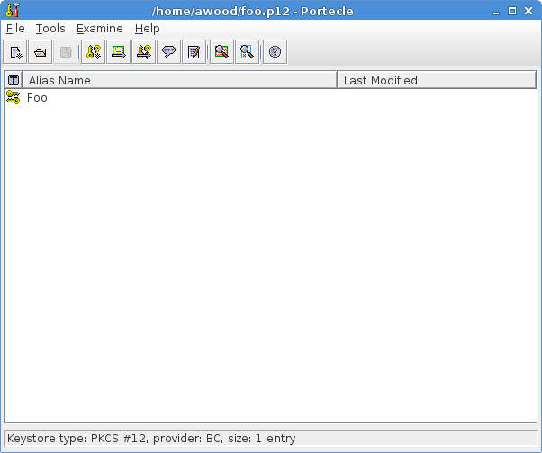
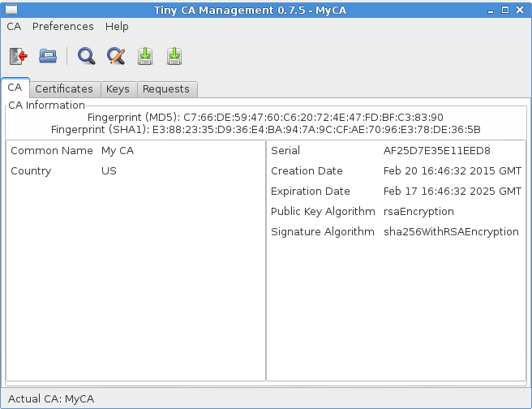

# Tools and Libraries

- OpenSSL
- NSS
- Java
- Others
- Compatibility Issues

--
# OpenSSL

- Very common and extremely versatile
- Has a plethora of subcommands
  - The `man` pages for a subcommand are accessed directly

    ```none
    % man x509
    % man genrsa
    ```
- Contrary to convention, all long options use a single hyphen

  ```none
  % openssl x509 -in foo.pem -text
  ```
- Generally works with PEM files
- Notorious for vague and confusing error messages

--
# OpenSSL - General Concepts

- Governed by a conf file.  Default is `/etc/pki/tls/openssl.cnf`
- Most commands use `-in` and `-out` or variants
  - `-pubout`, `-keyout`, etc.
- `-noout` is useful to keep OpenSSL from spitting out the raw PEM all the
  time
- Passwords can be read in using `-passin` or `-passout` and a special syntax
  - `-passout pass:hello` Encrypt with password "hello"
  - `-passin file:/tmp/secret` Decrypt with contents of file `/tmp/secret`
  - `-passin stdin` Decrypt with whatever gets piped in through `stdin`
- If you are using `file` for passwords, make sure your file is *exactly* right.  No
  trailing newlines (use `echo -n`)!
    - OpenSSL will tolerate a newline, others may not
      ```none
      % echo  "hello" > secret.txt ; openssl rsa -in foo.key -passin file:secret.txt -noout -check
      RSA key ok

      % echo -n "hello" > secret.txt ; openssl rsa -in foo.key -passin file:secret.txt -noout -check
      RSA key ok

      % echo "goodbye" > secret.txt; openssl rsa -in foo.key -passin file:secret.txt -noout -check
        unable to load Private Key
        140405449365376:error:06065064:digital envelope routines:EVP_DecryptFinal_ex:bad decrypt:evp_enc.c:596:
        140405449365376:error:0906A065:PEM routines:PEM_do_header:bad decrypt:pem_lib.c:483:
      ```
--
# OpenSSL - Generating Keys

```none
% openssl genrsa -out foo.key 2048
```

- Last number is the number of bits in the key
- Key can be encrypted immediately with `-idea`, `-aes192`, `-aes256`
  - AES options are not in the man pages as of Fedora 20
  - There is a `-des` option to encrypt with DES.  Do **not** use it.  DES is old
- Results in PKCS1 file containing the **private key**
  - Public key can be derived if you need it

    ```none
    % openssl rsa -in foo.key -out foo.pub -pubout
    ```

--
# OpenSSL - Creating a CSR (Simple)

```none
% openssl req -new -key foo.key -out foo.csr
```

- Will ask you lots of questions to build the certificate Subject
  - Most important is the Common Name (CN).  If you are generating a server
    certificate, this value should match the server's hostname (unless you
    are using SubjectAltNames).
  - Common Names can contain wildcards: "*.fedoraproject.org"
- Will ask for a "challenge password".  Don't bother
- Tedious to answer these questions. Two options:
  - Default answers can be specified in an OpenSSL conf file and the file
    passed in with `-config`
  - Use `-subj` and pass in components delimited with a slash

    ```none
    -subj /C=US/O=Acme Inc./CN=localhost
    ```

Note:
The "challenge password" was meant to be an additional means of
authenticating to CAs if a certificate needed to be revoked.  Most CAs do not
use it and it does not add any additional security to the CSR.

--
# OpenSSL - Creating a CSR (Advanced)

```none
% cat /etc/pki/tls/openssl.cnf - <<CONF > san.cnf
[ my_extensions ]
subjectAltName=DNS:www.example.com,DNS:www.example.org
CONF
% openssl req -new -key foo.key -out foo.csr -subj '/CN=Example Corp Cert' -config san.cnf -reqexts my_extensions
```

- Begin with a valid OpenSSL config file
- Add a section with your extensions
- Use the `-reqexts` option to request that section be used in the CSR

Notice that I am not using a host name as the CN since the hostnames are
within the SubjectAltNames.  [RFC 2818, Section 3.1](http://tools.ietf.org/html/rfc2818#section-3.1)
says if a cert has SubjectAltNames, the CN is ***ignored*** by the client.

There would be no harm in using a hostname for the CN, but it might be
confusing to others who don't know the CN gets ignored.

--
# OpenSSL - Creating a CA/Self-Signed Certificate

```none
% openssl req -new -x509 -key my_ca.key -out my_ca.crt -days 3650
```

- Useful for smoke tests, rapid development
- Is marked **by default** as a CA
- To be explicit about creating a CA add `-extensions v3_ca`
- If you intend to use the cert as a CA:
  - Put something in the CN like "My Test CA" to indicate the purpose
  - Use a long validity period (5 years at least)

--
# OpenSSL - Creating a Self-Signed Cert Fast

```none
%  openssl req -new -x509 -newkey rsa:2048 -nodes -days 365 -subj '/CN=localhost' -out x.crt -keyout x.key
```

- Creates the key inline
- `-nodes` prevents the default key encryption

--
# OpenSSL - Signing Certificates (Ad Hoc)

```none
% openssl x509 -req -days 365 -in foo.csr -out foo.crt -CA my_ca.crt -CAkey my_ca.key -CAcreateserial
```

- Great for development.  Not great for managing large numbers of certificates
- A serial number must be provided (decimal or hex with `0x`)
  - By default, expects a file named `<crt file basename>.srl`
    containing a hex number.  E.g. `my_ca.srl`
  - `-CAserial my_serial_list.srl` lets you use an arbitrary file
  - `-CAcreateserial` auto-generates a serial number for the cert and
    creates the srl file for later use
  - `-set_serial 0xDEADBEEF` works if you want to specify the serial on the
    CLI
- After a serial is used, OpenSSL increments the value in the `.srl` file
- If no serial is provided, OpenSSL emits a cryptic riddle

  ```none
  my_ca.srl: No such file or directory
  140437440989056:error:02001002:system library:fopen:No such file or directory:bss_file.c:398:fopen('my_ca.srl','r')
  140437440989056:error:20074002:BIO routines:FILE_CTRL:system lib:bss_file.c:400:
  ```
- **No extensions** on the CSR are copied over by default

--
# OpenSSL - Signing Certificates (Managed)

- For managing large numbers of certificates use `openssl ca`
- Lightweight tool to track revocations, serials, define signing policies
- Create a custom OpenSSL conf file and directory structure
- **No extensions** on the CSR are copied over by default
- To copy extensions:
  - In the CA section of the conf file set `copy_extensions = copy`
  - Set `basicConstraints = CA:FALSE`
  - These two settings will copy over requested extensions except for the CA
    extension.
  - Prevents the case where an unwitting operator creates and issues a sub-CA
    from a malicious CSR

--
# OpenSSL - Looking at Existing Things

```none
% openssl rsa -in foo.key -noout -text
% openssl req -in foo.csr -noout -text
% openssl x509 -in foo.crt -noout -text
```

- `-noout` stops OpenSSL from printing the PEM
- `-text` is everything interesting
- Other arguments let you narrow things down
  - `-fingerprint` is the definitive way to identify a cert

    ```none
    % openssl x509 -in fedora-ca.cert -noout -fingerprint
    SHA1 Fingerprint=92:9C:BF:A0:5E:70:99:2C:2C:7A:2C:41:83:DC:09:74:E4:8F:D7:B4
    ```
--
# OpenSSL - PKCS12

```none
% openssl pkcs12 -export -in foo.crt -inkey foo.key -name Foo -out foo.p12
```

- What? A binary storage container for keys and certs
- Why? Because NSS and Java will not import/export keys in PEM format but will
  with PKCS12s
- Also lets you import client certificates and keys into Firefox

--
# OpenSSL - So Much More

- Convert PEM to DER and back
- `s_client` Telnet over SSL
- `s_server` netcat -l over SSL and poor man's HTTP server
- Encrypt things with symmetric ciphers
- Read CRLs

--
# OpenSSL - Gotchas

- Sometimes people put multiple ASN.1 objects of the same type in a file.
  Classic example is people building a chain of certificates.  OpenSSL will
  only look at the ***first*** ASN1 object of the type you ask for.

Note:
You can of course put a key and cert together in a file because those are
different ASN1 objects and OpenSSL will read the key with the "rsa"
subcommand and the cert with the "x509" subcommand.

--
# NSS

- Mozilla's PKI solution
- CLI tool is `certutil`
- Instead of PEM files, everything is stored in sqlite databases (`cert9.db`,
  `key4.db`)
  - But there is also a legacy format!  To be unambiguous `certutil` let's you
    specify a database type prefix
- First option is always a capital letter that specifies the subcommand
- Certificates in the database have different levels of trust
- Databases have different "tokens" that segment them
- Way more command line options for extensions than OpenSSL
- Much harder to use than OpenSSL in my opinion

--
# NSS - Creating a Database

```none
% mkdir mynss
% certutil -N -d ~/mynss
```

- `-N` for "new"
- Will ask for a password for the database, but you can give it an empty string

--
# NSS - Viewing the Database

```none
% certutil -L -d ~/mynss
Certificate Nickname                                         Trust Attributes
                                                             SSL,S/MIME,JAR/XPI

% certutil -L -d sql:~/mynss
certutil: function failed: SEC_ERROR_BAD_DATABASE: security library: bad database.

% certutil -L -d sql:$HOME/mynss
Certificate Nickname                                         Trust Attributes
                                                             SSL,S/MIME,JAR/XPI
```

- `-L` for "list"
- Can be maddeningly picky about paths

--
# NSS - Importing a Certificate

```none
% certutil -A -d ~/mynss -n "Fedora CA" -t "CT,," -i ~/fedora-server-ca.cert
```

- `-A` for "add"
- `-n` is a nickname for the cert
- `-t` is the trust level
  - Broken into three fields
    - SSL/TLS (probably the one you will care about most)
    - S/MIME
    - Code Signing
  - Many different values
    - `p` prohibited (for a compromised cert)
    - `c` valid CA
    - `T` CA trusted to issue client certs (implies `c`)
    - `C` CA trusted to issue server certs (implies `c`)
    - `u` user certificate
    - Even more.  See man page

--
# NSS - Viewing Specific Items

```none
% certutil -L -d ~/mynss
Certificate Nickname                                         Trust Attributes
                                                             SSL,S/MIME,JAR/XPI

Fedora CA                                                    CT,,

% certutil -L -d ~/mynss -n "Fedora CA"
[ Text view of certificate ]

% certutil -L -d ~/mynss -n "Fedora CA" -a
[ PEM output ]
```

- `-a` is for ASCII output

--
# NSS - Deleting Certificates

```none
% certutil -D -d ~/mynss -n "Fedora CA"
```

- `-D` for "delete"

--
# NSS - Importing a Certificate **and** Key

```none
% openssl pkcs12 -export -in foo.crt -inkey foo.key -name Foo -out foo.p12
Enter Export Password:
Verifying - Enter Export Password:

% pk12util -i foo.p12 -d ~/mynss
Enter password for PKCS12 file:
pk12util: PKCS12 IMPORT SUCCESSFUL

% certutil -L -d ~/mynss
[...]
Foo                                                          u,u,u

% certutil -M -d ~/mynss -n Foo -t 'CT,,'
```

- Have to use `pk12util` to convert from PKCS12 to NSSDB
- Certificate is initially imported with no trust
- Use `-M` to modify the trust levels on the certificate

--
# NSS - Getting a Key Out

```none
% pk12util -o out.p12 -n Foo -d ~/mynss
% openssl pkcs12 -in out.p12 -out key_and_cert.pem -nodes
% cat out.p12
Bag Attributes
    friendlyName: Foo
    localKeyID: 7C 2E 29 2E F8 DF 1E 75 9D C2 07 74 B7 FF 53 D3 E9 D3 2D CC
Key Attributes: <No Attributes>
[ Key PEM here ]

Bag Attributes
    friendlyName: Foo
    localKeyID: 7C 2E 29 2E F8 DF 1E 75 9D C2 07 74 B7 FF 53 D3 E9 D3 2D CC
subject=/CN=arkham.usersys.redhat.com/C=US/L=Raleigh
issuer=/CN=arkham.usersys.redhat.com/C=US/L=Raleigh
[ Cert PEM here ]
```

- Opposite of importing
- Everything gets dumped into one big PEM file along with some
  other metadata

--
# NSS - Even more

- Generate keys
- Generate CSRs
- Sign certificates
- Tedious to use
  - Extensions are easier than OpenSSL (especially SubjectAltNames)
  - But having to work through the database means you always have to remember
    the nicknames and moving, deleting, copying are more complicated
  - Gets very confusing when dealing with multiple tokens
- My recommendation: for development situations, OpenSSL is just fine.  For
  high volume and/or high security situations, NSS is a better choice.

--
# NSS - Gotchas

- Importing a cert already in the DB with a name that is also already in
  the DB silently fails with return code 0

  ```none
  % certutil -A -d ~/mynss -n X -t ,,, -i amazon.crt
  % certutil -A -d ~/mynss -n X -t ,,, -i fedora-ca.crt
    certutil: could not add certificate to token or database: SEC_ERROR_ADDING_CERT: Error adding certificate to database.
  % certutil -A -d ~/mynss -n Fedora -t ,,, -i fedora-ca.crt
  % certutil -A -d ~/mynss -n X -t ,,, -i fedora-ca.crt
  % echo $?
  0
  % certutil -L -d ~/mynss -n X
  [...]
  Subject: "CN=www.amazon.com,O="Amazon.com, Inc.",L=Seattle,ST=Washing
            ton,C=US"
  [...]
  ```
- Surprisingly easy to run into this situation during development when names and certs
  are in flux

--
# Java

- Java has its own special binary format: JKS
- Java has its own special CA bundle: `$JAVA_HOME/jre/lib/security/cacerts`
- On Fedora the bundle is a symlink to `/etc/pki/java/cacerts`
- Default password to the CA bundle is "changeit"
- CLI command is `keytool`
- Same restriction as NSS on importing and exporting keys
- `keytool` can perform some operations on PKCS12s natively

--
# Java - Viewing Items

```none
% keytool -list -keystore /etc/pki/java/cacerts
Enter keystore password:

Keystore type: JKS
Keystore provider: SUN

Your keystore contains 165 entries
[...]
Certificate fingerprint (SHA1): 43:13:BB:96:F1:D5:86:9B:C1:4E:6A:92:F6:CF:F6:34:69:87:82:37
geotrustprimarycertificationauthority, Jan 26, 2015, trustedCertEntry,
[...]
```

- Like NSS, every item has a name called an alias

--
# Java - Importing Items

```none
% keytool -importkeystore -destkeystore my_keystore.jks -srckeystore foo.p12 -srcstoretype pkcs12 -alias Foo -srcstorepass ""
Enter destination keystore password:
Re-enter new password:
```

- Very picky about passwords.  Not using a password on the PKCS12 requires
  passing in `-srcstorepass ''`
- Password on destination keystore is mandatory

--
# Java - Exporting Items

```none
% keytool -importkeystore -destkeystore out.p12 -srckeystore my_keystore.jks -deststoretype pkcs12 -alias Foo
Enter destination keystore password:
Re-enter new password:
Enter source keystore password:
Enter key password for <Foo>
Enter key password for <Foo>
Enter key password for <Foo>
keytool error: java.lang.Exception: Too many failures - try later

% keytool -importkeystore -destkeystore out.p12 -srckeystore my_keystore.jks -deststoretype pkcs12  -alias Foo -srckeypass ''
Enter destination keystore password:
Re-enter new password:
Enter source keystore password:
```

- Note that I had to provide a password for the key even though the key didn't
  actually have one on it.  Just hitting return at the prompt won't work
- Result is a PKCS12 that can be manipulated using friendlier tools

--
# Keytool - Even more

- Generate keys
- Sign certificates
- Generally low on features with weak documentation
- Why bother?  Just use OpenSSL or NSS

--
# Other Tools - Bouncy Castle

- The de facto Java crypto library
- Fairly easy to work with
- Not FIPS certified
  - Things sold to the US government often need FIPS
    certification

--
# Other Tools - Portecle

- Java based GUI for PKI
- Perfect for browsing PKCS12s, JKSs, PEM bundles
- Easy to add and remove things from PKCS12s and JKSs
- Can't do NSS DBs
- I highly recommended it



--
# Other Tools - Dogtag

- Red Hat sponsored open source project
- Enterprise level PKI
- Enterprise level of complexity
- Use if you are dealing with hundreds of certificates, keys, CSRs, etc.

--
# Other Tools - TinyCA

- GUI for CA management
- Create CAs
- Manage signing and revocations



--
# Compatibility Issues - Java

- OpenSSL outputs PKCS1 formated RSA keys.  Java only wants to read PKCS8.
  - Solution: Use Bouncy Castle
  - Can't use Bouncy Castle? Prepare for a painful experience of reading in the PEM,
    converting to ASN1 and reading out RSA primatives.

