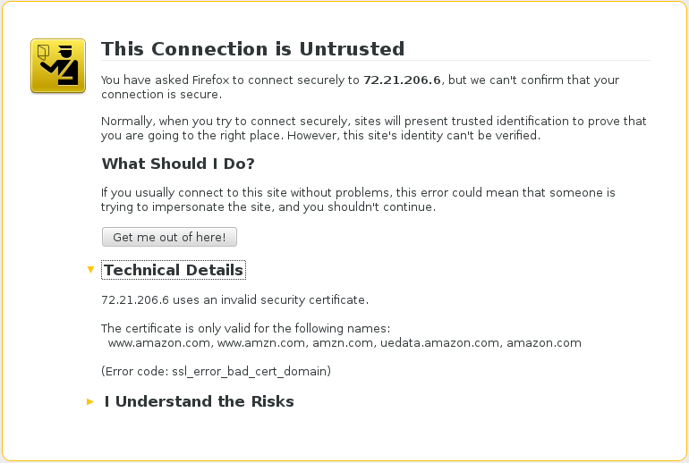

# The Most Common Errors

**These solutions are only relevant for development.**

| Problem | Solution |
|-|-|-|
| Unknown issuer | Add the cert for the CA that signed the cert you are receiving |
| Hostname verification failed | Connect to the correct hostname **or** reissue a correct certificate |

--
# Most Important Lesson

Pay attention to these!  Do not ignore or disable them! <!-- .element class="caption" style="font-weight: bold;" -->

Note:
Now you know enough to look at the Technical Details section and make an educated decision but you
should never ignore these if the appear on a site that you don't have control over.

--
# Further Reading

- [Bulletproof SSL and TLS](https://www.feistyduck.com/books/bulletproof-ssl-and-tls/) by Ivan Ristić
  - Very thorough and eminently readable.  Highly recommended
- [Survival Guide - TLS/SSL and SSL (X.509) Certificates](http://www.zytrax.com/tech/survival/ssl.html)
- [A Layman's Guide to a Subset of ASN.1, BER, and DER](http://luca.ntop.org/Teaching/Appunti/asn1.html)
- [The First Few Milliseconds of an HTTPS Connection](http://www.moserware.com/2009/06/first-few-milliseconds-of-https.html)
- [Mozilla CA Certificate Policy](https://www.mozilla.org/en-US/about/governance/policies/security-group/certs/policy/)
- [X509 - RFC 5280](https://tools.ietf.org/html/rfc5280)
- [OCSP - RFC 6960](https://tools.ietf.org/html/rfc6960)
- [TLS 1.2 - RFC 5246](https://tools.ietf.org/html/rfc5246)
- [RSA - RFC 3447](https://tools.ietf.org/html/rfc3447)
- [Legion of the Bouncy Castle](https://www.bouncycastle.org/)
- [NSS](https://developer.mozilla.org/en-US/docs/Mozilla/Projects/NSS)
- [OpenSSL](https://www.openssl.org/)

--
# Credits

- [Image of Alice Cooper](http://commons.wikimedia.org/wiki/File:Alice_Cooper_Live_in_London_2012-10-28.jpg)
  by [Kreepin Derth](http://commons.wikimedia.org/wiki/User:Kreepin_Deth)
  licensed under [CC-BY-SA 3.0 Unported](http://creativecommons.org/licenses/by-sa/3.0/deed.en)

- [Image of Robert Plant](http://commons.wikimedia.org/wiki/File:Robert-Plant.jpg)
  by Dina Regine licensed under [CC-BY-SA 2.0 Generic](http://creativecommons.org/licenses/by-sa/2.0/deed.en)

- [Image of Hobo](http://commons.wikimedia.org/wiki/File:Hobo_sitting_on_a_fence,_ca.1920_%28CHS-1428%29.jpg)
  by Charles C. Pierce from Public Domain

- [Image of Enigma Machine](http://commons.wikimedia.org/wiki/File:Enigma_Machine_-_Flickr_-_The_Central_Intelligence_Agency_%282%29.jpg) from Public Domain

--
# Questions ?

Suggestions and corrections: <!-- .element class="caption" -->
https://github.com/candlepin/candlepinproject.org/issues
